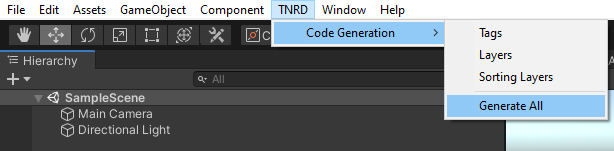
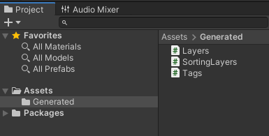

# Layers & Tags Generator

<p align="center">
	
	<a href="https://github.com/Thundernerd/Unity3D-LayersTagsGenerator/issues">
		
	</a>
	<a href="https://github.com/Thundernerd/Unity3D-LayersTagsGenerator/pulls">
		
	</a>
	<a href="https://github.com/Thundernerd/Unity3D-LayersTagsGenerator/blob/master/LICENSE.md">
		
	</a>
	
</p>

A package that contains generators that will generate classes containing the project's Layers and Tags for easy access.

## Installation
1. The package is available on the [openupm registry](https://openupm.com). You can install it via [openupm-cli](https://github.com/openupm/openupm-cli).
```
openupm add net.tnrd.layertagsgenerator
```
2. Installing through a [Unity Package](http://package-installer.glitch.me/v1/installer/package.openupm.com/net.tnrd.layertagsgenerator?registry=https://package.openupm.com) created by the [Package Installer Creator](https://package-installer.glitch.me) from [Needle](https://needle.tools)

[](http://package-installer.glitch.me/v1/installer/package.openupm.com/net.tnrd.layertagsgenerator?registry=https://package.openupm.com)

## Usage

Once you have installed the package into your project you can access the generators through the menu as shown below.

You can generate the Tags, Layers, and Sorting Layers all separately by using their respective menu items, or generate them all by using the Generate All menu item.





Once you have generated one or more through the menu, you will see the files appear in your project located int he Generated folder, which resides at top level in your Assets folder.



To use the generated files you simply access them through their classes which are: Tags, Layers, and SortingLayers.
Below is an example for Layer and Tag comparison.

```c#
public class Foo : MonoBehaviour
{
    private void OnCollisionEnter(Collision other)
    {
        if (other.transform.CompareTag(Tags.PLAYER))
        {
            // Tag
        }
	
	if (Layers.ENEMY_MASK & (1 << other.gameObject.layer)) > 0)
	{
            // Layer
	}
    }
}
```

## Support
Layers & Tags Generator is an open-source project that I hope helps other people. It is by no means necessary but if you feel generous you can support me by donating.

[](https://ko-fi.com/J3J11GEYY)

## Contributions
Pull requests are welcomed. Please feel free to fix any issues you find, or add new features.

